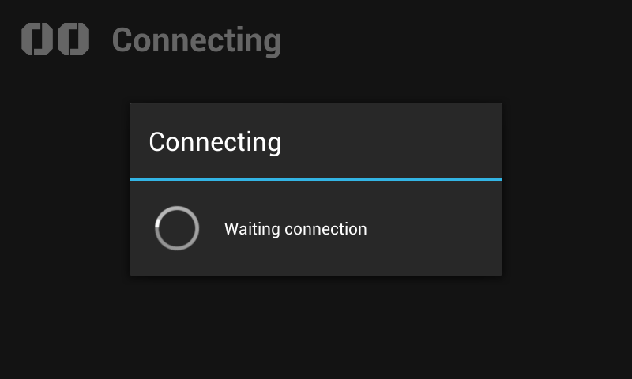
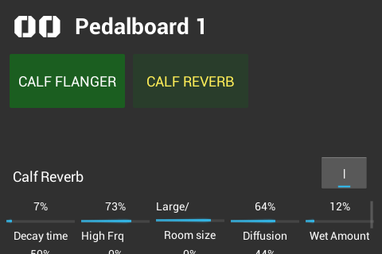
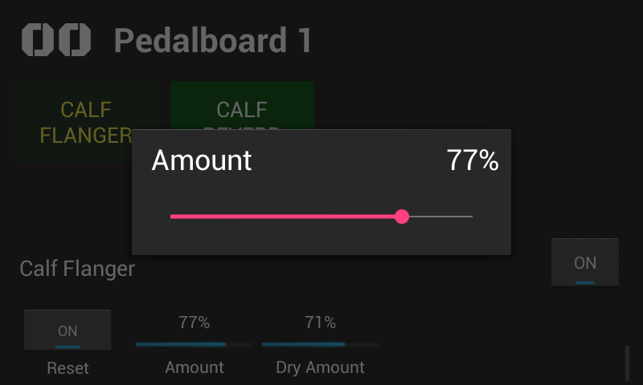

# Pedal Pi - Display View

Manage the current pedalboard with **Pedal Pi - Display View**

## Screenshots

## Legal attribution

* Google Play and the Google Play logo are trademarks of Google LLC.